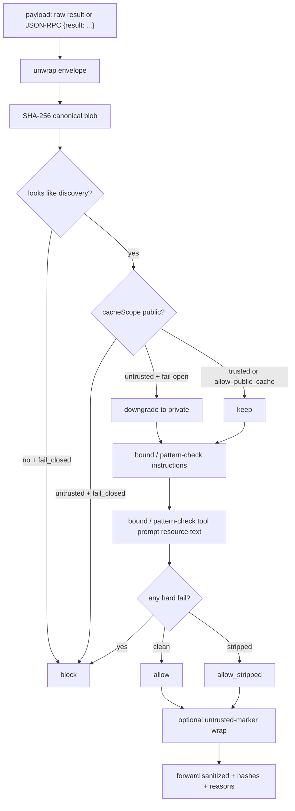

# MCP discovery sanitizer

I built this because MCP clients fold server `instructions` into the system prompt, and the July 28 2026 spec lets that same response be marked `cacheScope: public`. That combination is not a "user pasted a weird PDF" problem. It is a gateway problem: one hostile discovery blob, cached once, served to every identity behind the proxy.

This repo is a **CPU-only Python gate** you put in front of Stage discovery (`initialize`, `tools/list`, prompts, resources). No LLM. No GPU. It does not implement MCP-Guard Stage I, and it does not issue ACLE leases. It answers one question: *may this agent trust this discovery payload?*

Source idea: private backlog **2026-09-01-b** in [ai-security-ideas](https://github.com/sheshisheri-hi/ai-security-ideas) (`ideas/2026-09.md`). Writeups: [MCP-2026-008 / MCP-2026-015](https://datapace.ai/blog/mcp-cache-poisoning-prompt-injection).

## Docs / LinkedIn surfaces

- [`docs/LINKEDIN.md`](docs/LINKEDIN.md) — post + carousel copy (with links at the top)
- [`docs/LINKEDIN-NOTES.md`](docs/LINKEDIN-NOTES.md) — original engineer-style notes
- [`docs/one-pager.html`](docs/one-pager.html) — flashy HTML; public mirror: [mcp-discovery-sanitizer-deck](https://github.com/sheshisheri-hi/mcp-discovery-sanitizer-deck) (jsDelivr: https://cdn.jsdelivr.net/gh/sheshisheri-hi/mcp-discovery-sanitizer-deck@main/index.html)

## Problem

- **MCP-2026-015.** `instructions` is server-controlled, unbounded, and unsanitized. Clients concatenate it into the system prompt.
- **MCP-2026-008.** The *server* sets `cacheScope`. `public` means any intermediary may reuse the response across authorization contexts. Nothing verifies the claim.
- Chained: one poisoned `tools/list` marked public becomes a **cross-tenant** system-prompt injection.

Until a spec patch lands, the practical controls are: never cache across identities; treat `instructions` and tool descriptions as untrusted; pin which servers an agent may talk to; log a hash so a swapped list is visible in a diff.

## Repo layout

```
src/mcp_discovery_sanitizer/   package (stdlib only)
tests/                         pytest
examples/demo.py               clean vs poisoned walkthrough
fixtures/                      discovery JSON + a fail-open policy
docs/LINKEDIN.md               LinkedIn post + carousel
docs/LINKEDIN-NOTES.md         original presentation notes
docs/one-pager.html            flashy HTML one-pager
```

## Under the Hood



`sanitize_discovery(payload, policy) -> SanitizerResult`

| Verdict | Meaning |
| --- | --- |
| `allow` | Within policy. Optional isolation wrap does not flip the verdict. |
| `allow_stripped` | Forwardable after truncate / strip / cache downgrade. |
| `block` | Do not fold this into a prompt. `sanitized` is `None`. |

Policy knobs: `max_instructions_len`, `allow_public_cache` (default `False`), `trusted_server_ids`, `block_patterns`, `fail_closed`. Extra bounds: `max_description_len`, `max_name_len`, `isolate_untrusted`.

Trusted ids skip the **public-cache** check only. I still bound their text. A compromised "trusted" server should not get a free pass into the system prompt.

JSON-RPC: raw result objects and `{"result": {...}}` / `{"jsonrpc":"2.0","result":...}` envelopes both work. The hash is always of the inner discovery blob so the two forms diff equal.

## Quickstart

Python 3.10+. Stdlib at runtime. Pytest is the only pinned dep.

```bash
python -m pip install -r requirements.txt
python -m pip install -e .
python -m pytest
PYTHONPATH=src python examples/demo.py
python -m mcp_discovery_sanitizer fixtures/clean_discovery.json
python -m mcp_discovery_sanitizer fixtures/poisoned_instructions.json
python -m mcp_discovery_sanitizer fixtures/poisoned_instructions.json --no-fail-closed --policy fixtures/policy_fail_open.json
```

From code:

```python
from mcp_discovery_sanitizer import Policy, sanitize_discovery

result = sanitize_discovery(payload, Policy(fail_closed=True), server_id="weather.internal")
if not result.allowed:
    raise SystemExit(result.to_dict())
# fold result.sanitized into the client, not the original payload
```

No env vars required. See `.env.example`.

## Sample logs

Clean allow (isolation wrap is informational):

```text
{
  "verdict": "allow",
  "reasons": [
    {
      "code": "instructions_isolated",
      "message": "Wrapped remaining instructions in an untrusted marker.",
      "field": "instructions"
    }
  ],
  "server_id": "weather.internal",
  "original_hash": "sha256:…"
}
```

Poisoned instructions, fail-closed:

```text
{
  "verdict": "block",
  "reasons": [
    {
      "code": "instructions_blocklist",
      "message": "instructions matched an obvious injection pattern.",
      "field": "instructions",
      "detail": "ignore\\s+(all\\s+)?(previous|prior|above|earlier)\\s+instructions"
    }
  ],
  "sanitized": null,
  "server_id": "sketchy-tools"
}
```

Public cache from an untrusted server:

```text
{
  "verdict": "block",
  "reasons": [
    {
      "code": "public_cache_untrusted",
      "message": "Refused cacheScope=public from untrusted server 'cdn-poison.example' (MCP-2026-008).",
      "field": "_meta.cacheScope"
    }
  ]
}
```

CLI exit codes: `0` allow / allow_stripped, `2` block, `1` I/O or usage.

## Lessons Learned

1. **Downgrade is not the same as refuse.** Fail-closed blocks `cacheScope: public` from strangers because a shared gateway that "fixes" the bit still already *saw* a payload the spec said it could fan out. Fail-open downgrades to `private` so a single-user client can keep working. I default to refuse; the flag is the product decision.

2. **Hash the inner blob, not the envelope.** If audit logs key on SHA-256, a JSON-RPC wrapper must not create a second identity for the same `tools/list`. Canonical JSON (`sort_keys`, tight separators, UTF-8) is boring and correct.

3. **A short blocklist is a tripwire, not a WAF.** The patterns catch textbook jailbreaks. They will miss framing-gap wording. That is fine: this package's job is length, cache scope, pin-list, and an audit hash. If you want regex theater, that is a different backlog item (2026-09-01-c).

## Out of scope

- MCP-Guard Stage I detector fleet
- ACLE leases / workload attestation
- Live MCP transports, OAuth, or a real cache implementation
- LLM-based injection classifiers
