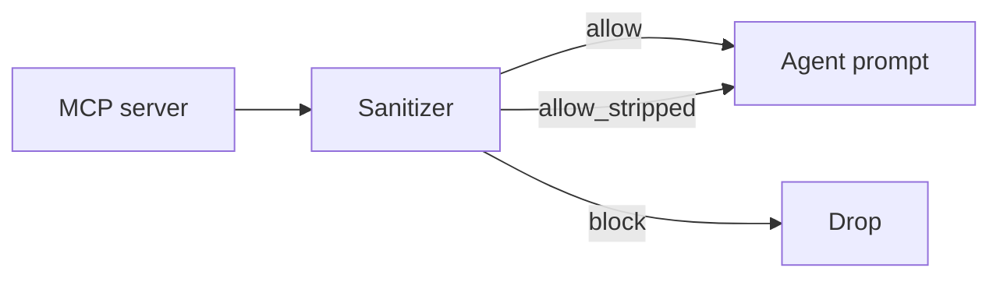

# LinkedIn / presentation notes (original sketch)

Earlier engineer-style one-pager notes. Prefer `LINKEDIN.md` for post copy and `one-pager.html` for the flashy linkable page.

# One poisoned MCP server. Every teammate's agent.

**A shared cache plus an unsanitized `instructions` field turns one hostile server into a company-wide system-prompt injection.**

---

## The problem (3 bullets)

- Agents trust MCP discovery (`initialize`, `tools/list`) and paste it into the system prompt.
- The spec lets a server mark that response `cacheScope: public` — meaning "serve this to anyone."
- Nobody checks the claim. One intern's flashy server can rewrite every agent's brain.

---

## What we built (3 bullets)

- A **CPU-only** Python gate in front of discovery. No LLM. No GPU.
- **Allow / strip / block** with reasons you can read, plus a SHA-256 of the blob for diffs.
- Default-deny public cache from untrusted servers. Bound `instructions`. Treat tool text as hostile.

---

## Before / after

```
BEFORE                              AFTER
------                              -----
server --public cache--> everyone   server --> [sanitizer] --allow--> this user
        (poison travels)                      |--strip--> this user
                                              |--block--> nobody
```



---

## Fake screenshots

```
$ python -m mcp_discovery_sanitizer fixtures/clean_discovery.json
{
  "verdict": "allow",
  "server_id": "weather.internal",
  "original_hash": "sha256:1427a0f2…",
  "actions": ["isolated_instructions", "isolated_tools_description"]
}
```

```
$ python -m mcp_discovery_sanitizer fixtures/poisoned_instructions.json
{
  "verdict": "block",
  "server_id": "sketchy-tools",
  "sanitized": null,
  "reasons": [
    {
      "code": "instructions_blocklist",
      "message": "instructions matched an obvious injection pattern."
    }
  ]
}
```

---

## Try it

Repo: `https://github.com/sheshisheri-hi/mcp-discovery-sanitizer`

```
PYTHONPATH=src python examples/demo.py
python -m mcp_discovery_sanitizer fixtures/poisoned_instructions.json
```

Private sample of backlog **2026-09-01-b** (MCP-2026-008 / MCP-2026-015).
